# Topic Modeling on Newsgroup Posts

In this project, I used topic modeling to automatically discover the hidden themes within a collection of 17,841 online discussion posts - without ever telling the algorithm what the posts were about. Think of it like handing someone a massive stack of unlabeled documents and asking them to sort them into piles by subject. I tested two different approaches: Latent Dirichlet Allocation (LDA), a classic probabilistic method that has been a standard in the field for over two decades, and BERTopic, a modern approach that uses transformer-based language understanding to capture the meaning behind words rather than just counting them. Since the dataset comes with 20 known category labels, I was able to compare the topics each model discovered against the true subjects to evaluate how well each method performed. BERTopic achieved a coherence score of 0.7296 compared to LDA's 0.5936, demonstrating that transformer-based embeddings provide meaningfully better topic quality on this dataset.

---

## Dataset Overview

The dataset is the 20 Newsgroups collection, a well-known benchmark in natural language processing. It contains posts from 20 different online discussion groups (newsgroups) spanning topics like computer hardware, politics, religion, science, and sports.

| Property | Value |
|----------|-------|
| Total Posts (raw) | 18,846 |
| Posts After Cleaning | 18,178 |
| Posts After Preprocessing | 17,841 |
| Original Categories | 20 |
| Broad Category Groups | 7 |
| Mean Post Length | 188 words |
| Median Post Length | 86 words |
| Longest Post | 11,765 words |
| Source | scikit-learn (built-in dataset) |

The 20 categories fall into seven broad groups: computers (comp.\*), recreation (rec.\*), science (sci.\*), society/religion (soc.\*), politics (talk.politics.\*), religion/discussion (talk.religion.\*, alt.\*), and miscellaneous (misc.\*). Some categories are very similar to each other - for example, `comp.sys.ibm.pc.hardware` and `comp.sys.mac.hardware` both discuss computer hardware but for different platforms - which makes this dataset a realistic test of whether topic models can distinguish between closely related subjects.

I removed email headers, footers, and quoted text from each post so that the models had to rely on the actual content rather than metadata like email addresses or formatting patterns. I also removed empty posts, posts shorter than 20 characters, and duplicates, which eliminated 668 posts (3.5% of the original data).

---

## Exploratory Data Analysis

### Category Distribution

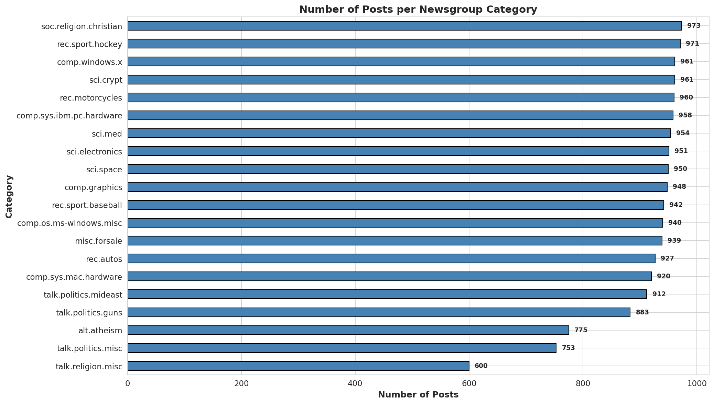

This chart shows how many posts belong to each of the 20 newsgroup categories. The distribution is fairly balanced - most categories have between 900 and 973 posts, with `soc.religion.christian` at the top (973) and `talk.religion.misc` at the bottom (600). This balance is helpful because it means no single topic dominates the dataset, giving both models a fair shot at discovering all 20 themes.

### Broad Category Distribution

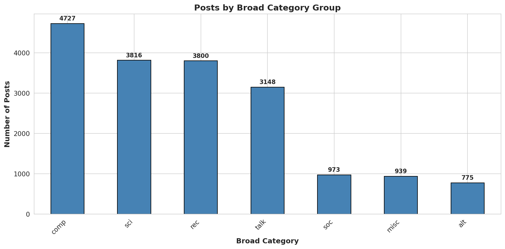

Grouping the 20 categories into their seven broad families shows that computer-related and recreation topics have the most posts, while miscellaneous and alternative topics have fewer. This broader view is useful because some topic models may discover themes at this higher level rather than distinguishing between, say, `rec.sport.baseball` and `rec.sport.hockey`.

### Document Length Distribution

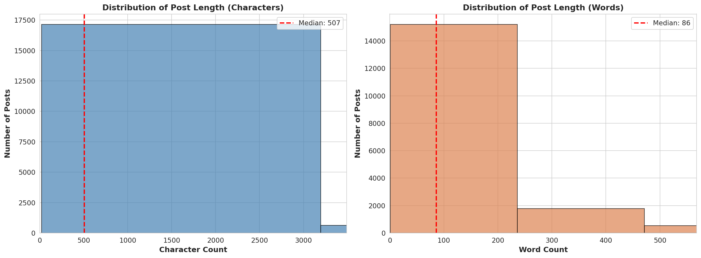

These histograms show the distribution of post lengths in both characters and words. Most posts are relatively short - the median is 86 words - but the distribution has a long right tail with some posts stretching past 11,000 words. Short posts give topic models less text to work with, making it harder to confidently assign a topic. The mean (188 words) being more than double the median tells us the distribution is heavily right-skewed: a small number of very long posts pull the average up.

### Post Length by Category

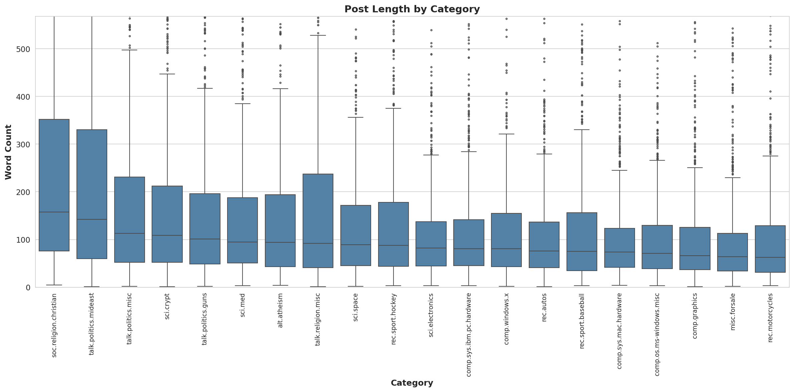

This box plot compares post lengths across the 20 categories. Some categories tend to produce longer posts - like `talk.politics.misc` and `talk.religion.misc`, where people write detailed arguments - while others tend to be shorter, like `misc.forsale`, where people post brief item descriptions. These length differences reflect the nature of the conversations in each group and can influence how well models capture each topic.

### Word Frequency

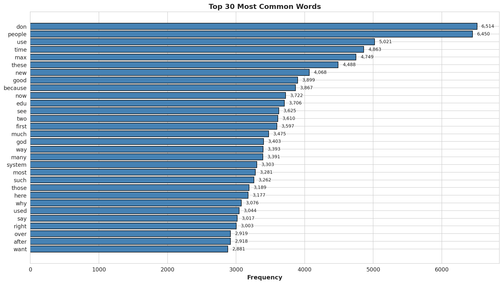

This chart shows the 30 most common words across all posts after removing common filler words. Domain-specific terms like "file," "program," "drive," and "system" appear frequently, reflecting the technical nature of many newsgroup discussions. The presence of words like "god," "government," and "space" hints at the religious, political, and scientific topics in the dataset.

### Word Frequency by Broad Category

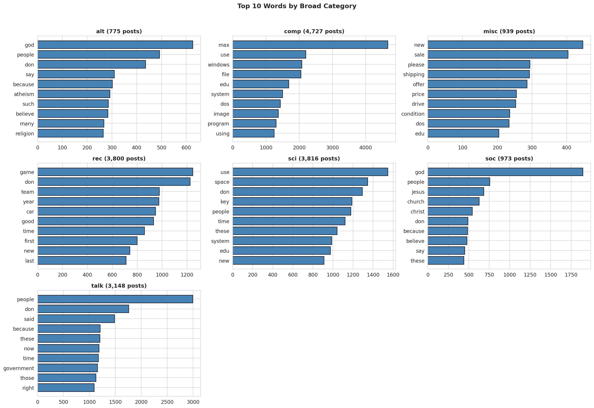

This panel shows the top 10 words within each broad category group. The differences are striking - computer groups feature words like "drive," "windows," and "card," while science groups feature "space," "medical," and "launch." These distinct vocabularies are exactly what topic models look for when discovering themes. Categories with overlapping vocabulary - like politics and religion, which both use words like "people" and "believe" - will be harder for models to separate.

---

## Text Preprocessing

Before feeding text into the models, I cleaned and standardized it through the following pipeline:

| Step | Description | Purpose |
|------|-------------|---------|
| 1. Lowercasing | Convert all text to lowercase | "Windows" and "windows" treated as the same word |
| 2. Email/URL removal | Strip email addresses and web links | Remove metadata that is not topically informative |
| 3. Number removal | Remove numeric characters | Numbers rarely help distinguish topics |
| 4. Punctuation removal | Strip special characters and punctuation | Reduce noise in the vocabulary |
| 5. Stopword removal | Remove common filler words plus domain-specific stopwords | Eliminate words like "the," "is," "would" that appear in every topic |
| 6. Lemmatization | Reduce words to their base form | "running," "runs," "ran" all become "run" |
| 7. Short word removal | Remove words with fewer than 3 characters | Filter out fragments that carry no meaning |

**Example:**
- Original: *"I think the new Windows 3.1 drivers for the ATI card are available at ftp://..."*
- Cleaned: *"window driver ati card available"*

This pipeline reduced the average post length from 191 words to 85 words - a 55.6% reduction. Posts with fewer than 4 words remaining after cleaning were removed entirely, bringing the final dataset to 17,841 posts.

### Before vs. After Preprocessing

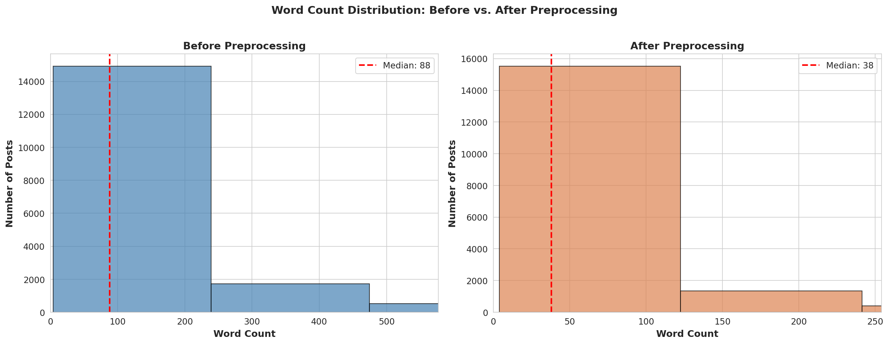

These side-by-side histograms show how preprocessing reduces the word count of each post. The cleaning pipeline removes roughly half of the words from each post, stripping away noise while preserving the meaningful content words that topic models need. Both distributions remain right-skewed, but the cleaned version is more concentrated - the signal-to-noise ratio is higher.

### Cleaned Word Frequency

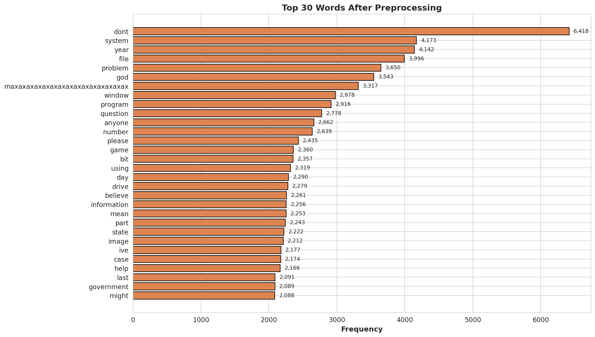

After preprocessing, the most frequent words are more topically informative - technical terms, subject-specific nouns, and action verbs that help distinguish one topic from another. This cleaner vocabulary gives both LDA and BERTopic a stronger signal to work with.

---

## Model 1: Latent Dirichlet Allocation (LDA)

LDA is a probabilistic model that treats each document as a mixture of topics, and each topic as a mixture of words. Think of it like this: when someone writes a post about computer hardware, they draw words from a "hardware" topic (drive, disk, controller) and maybe a bit from a "general computing" topic (system, file, program). LDA works backward from the observed words to figure out what those hidden topics must be.

I used gensim's implementation and tuned three key decisions:
- **Number of topics**: Tested 10, 15, 20, and 25 topics, selecting the count with the highest coherence score
- **Hyperparameters**: Used Bayesian optimization (Optuna, 5 trials) to tune alpha (0.0835) and eta (0.1121), which control how topics are distributed across documents and words
- **Vocabulary filtering**: Removed words appearing in fewer than 15 documents or more than 50% of documents, leaving a vocabulary of 8,410 terms

### Coherence Scores

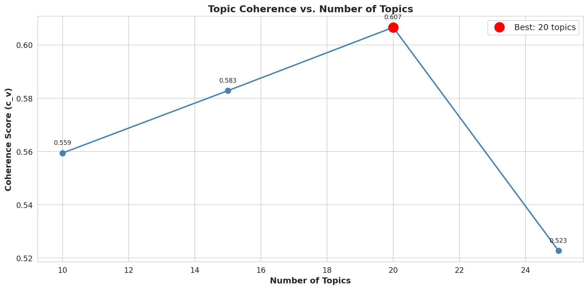

This chart shows the coherence score (c_v) at each tested topic count. Coherence measures how semantically similar the top words within each topic are - higher scores mean the topics are more interpretable to humans. The scores were:

| Topics | Coherence (c_v) |
|--------|----------------|
| 10 | 0.5594 |
| 15 | 0.5828 |
| **20** | **0.6066** |
| 25 | 0.5227 |

The best score occurred at 20 topics - which happens to match the true number of newsgroup categories. This is a strong indication that LDA is finding real structure in the data. After Optuna hyperparameter tuning, the final model achieved a coherence of 0.5936.

### Top Words per Topic

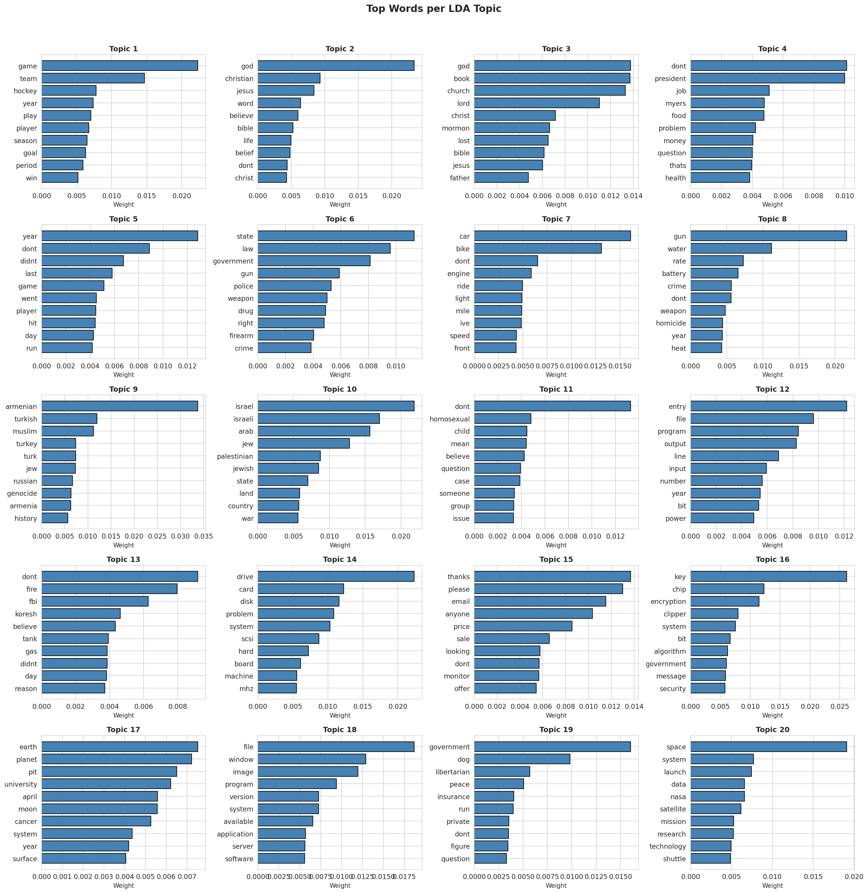

Each panel shows the 10 most representative words for one LDA topic, ranked by their weight (probability of appearing in that topic). Many topics clearly map to real newsgroup categories - for example, one topic is dominated by "space," "launch," "nasa," and "satellite" (corresponding to sci.space), while another features "game," "team," "hockey," and "player" (corresponding to rec.sport.hockey). Some topics are less distinct, mixing words from related categories - for instance, both religious topics share words like "god," "christian," and "jesus."

### Word Clouds

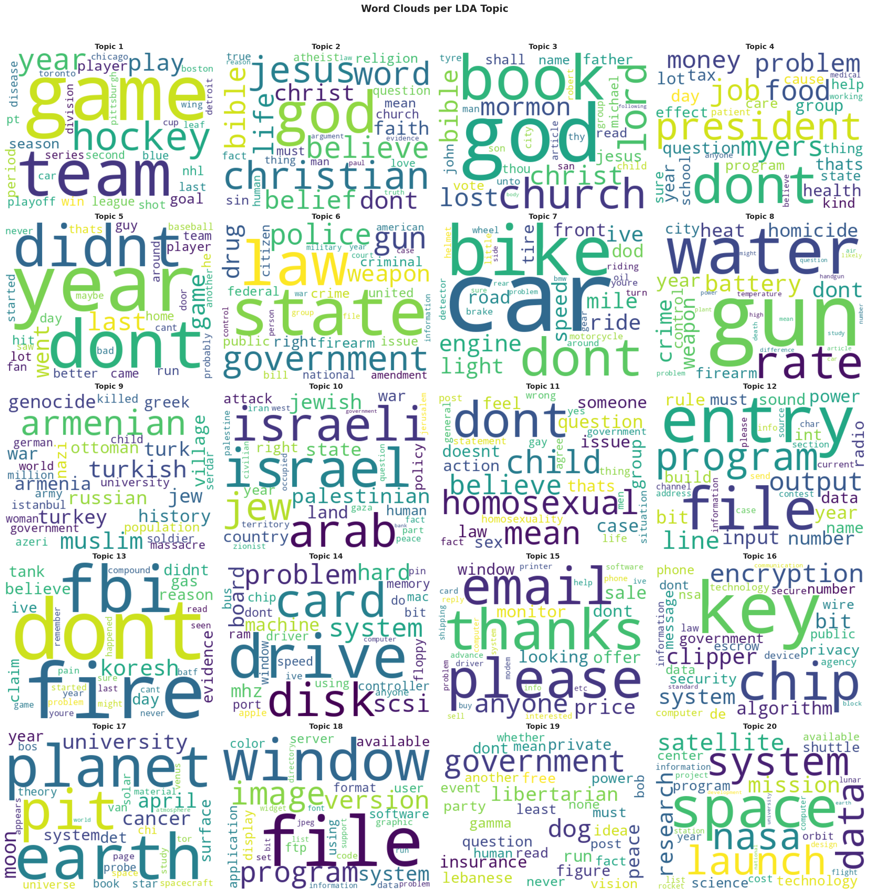

These word clouds provide an intuitive visual summary of each topic - larger words have higher weights. They make it easy to quickly scan all topics and get a sense of what each one is about without reading lists of words and numbers. Topics about space, religion, cryptography, and sports are immediately recognizable at a glance.

### Document Distribution by Topic

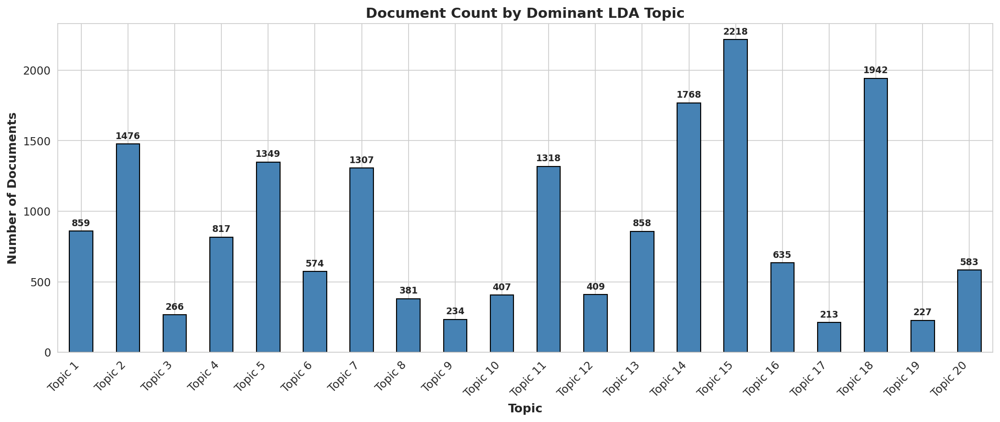

This bar chart shows how many documents are assigned to each topic based on their dominant topic. The distribution is reasonably balanced, though some topics attract more documents than others. A relatively even distribution suggests the model is finding balanced, meaningful themes rather than lumping most documents into one or two catch-all topics.

### Topic-Word Heatmap

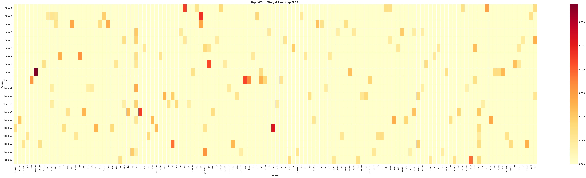

This heatmap shows the weight of key words across all 20 topics simultaneously. Dark cells indicate that a word is strongly associated with that topic. Ideally, each column (word) should have one or two dark cells - meaning the word is distinctive to specific topics rather than spread evenly across all of them. Words like "space," "hockey," and "encryption" are strongly concentrated in single topics, while more general words like "system" appear across several.

---

## Model 2: BERTopic

BERTopic takes a fundamentally different approach from LDA. Instead of treating documents as bags of words (ignoring word order and meaning), it first converts each post into a dense numerical vector called an embedding using a pretrained transformer model. Think of it like translating each post into a point in a high-dimensional space where posts about similar topics end up near each other - even if they use completely different words. It then uses UMAP to reduce the dimensionality of these embeddings and HDBSCAN to cluster similar documents together. Finally, it extracts topic descriptions using a class-based TF-IDF procedure.

I tuned BERTopic's key parameters using Bayesian optimization (Optuna, 10 trials):

| Component | Parameter | Tuned Value |
|-----------|-----------|-------------|
| Sentence Embeddings | Model | all-MiniLM-L6-v2 (384 dimensions) |
| UMAP | n_neighbors | 10 |
| UMAP | n_components | 4 |
| HDBSCAN | min_cluster_size | 75 |
| HDBSCAN | min_samples | 15 |
| Vectorizer | ngram_range | (1, 2) - supports bigrams |

### Top Words per Topic

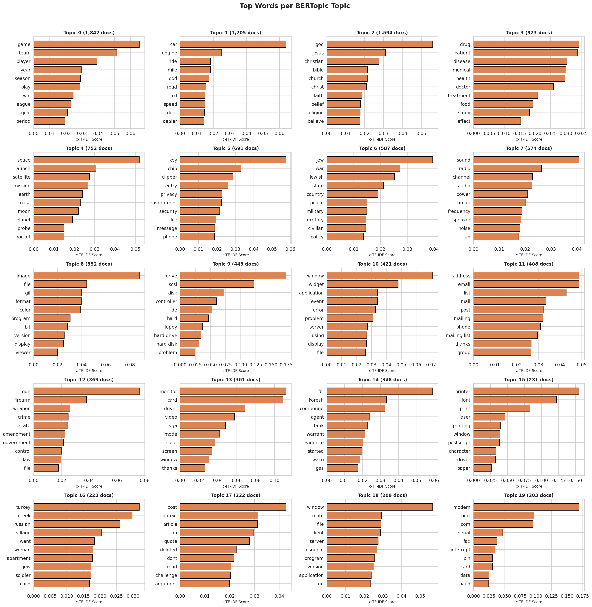

BERTopic's topic words tend to be more specific and contextually relevant than LDA's because the underlying embeddings capture semantic meaning rather than just word co-occurrence. Each panel shows the top words ranked by their c-TF-IDF score - a measure of how distinctive that word is to the topic compared to the rest of the corpus. Notice that some topics include bigrams (two-word phrases), which can make topics more immediately interpretable.

### Word Clouds

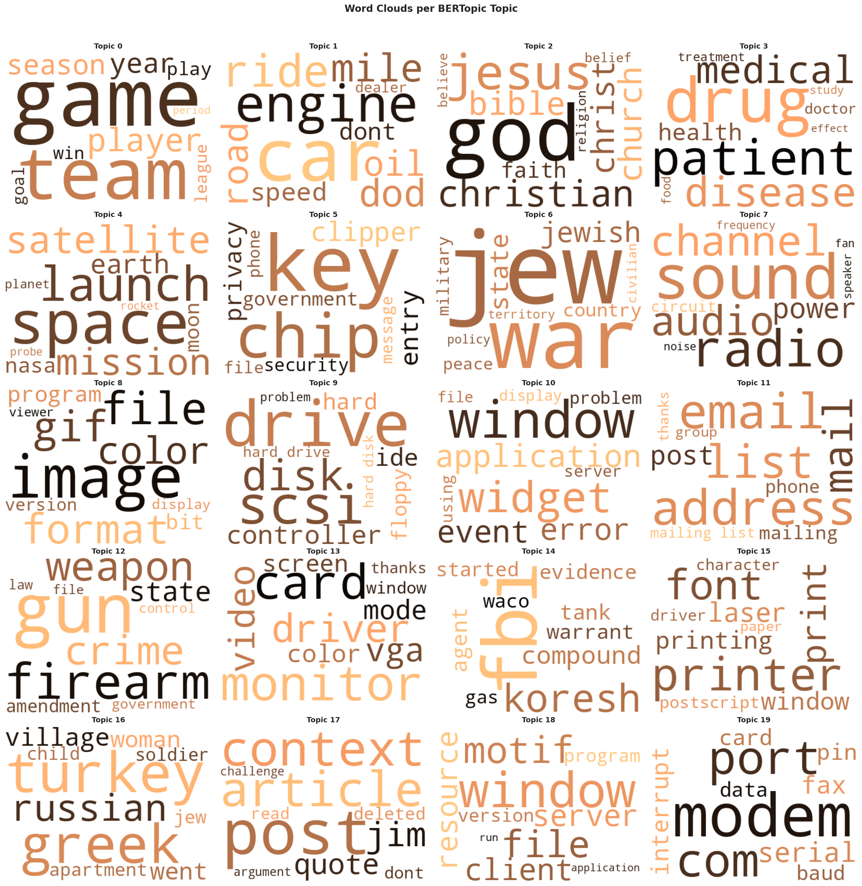

BERTopic's word clouds often include bigrams alongside single words, which can make topics more interpretable. For example, instead of separate words "hard" and "drive," you might see "hard drive" as a single meaningful unit. This is a direct advantage of BERTopic's CountVectorizer supporting ngram ranges.

### Document Distribution by Topic

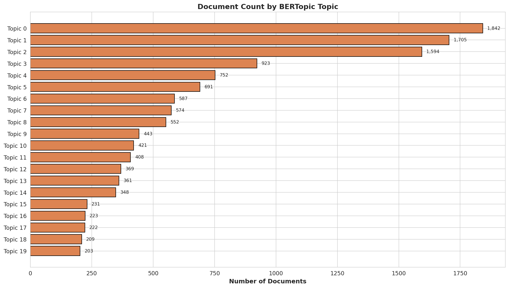

Unlike LDA, which assigns every document to a topic, BERTopic can label some documents as outliers - posts that do not clearly belong to any discovered topic. BERTopic discovered 30 topics and assigned 77.7% of documents to a topic, leaving 22.3% as outliers. The presence of outliers is actually a strength: rather than forcing every document into a topic where it might not belong, BERTopic honestly acknowledges when a post does not fit neatly into any category.

### Document Clusters

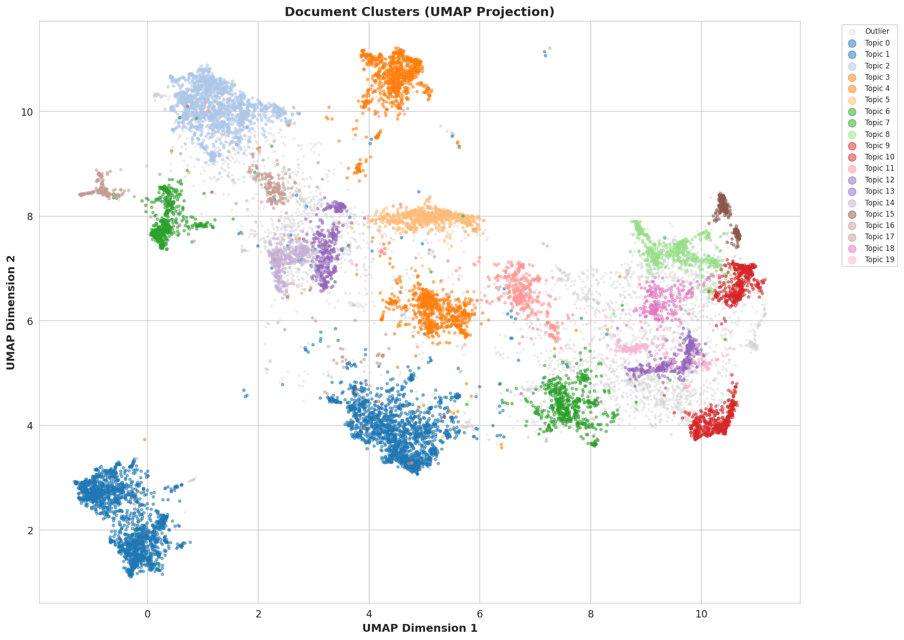

This scatter plot shows all documents projected onto two dimensions using UMAP, colored by their assigned topic. Documents that cluster tightly together share similar content, while documents in the gray "outlier" region are too dissimilar to be confidently assigned to any single cluster. Clear, well-separated clusters indicate strong topic distinctiveness. The visible separation between clusters confirms that the transformer embeddings are capturing genuine thematic differences between posts.

### Topic Similarity Heatmap

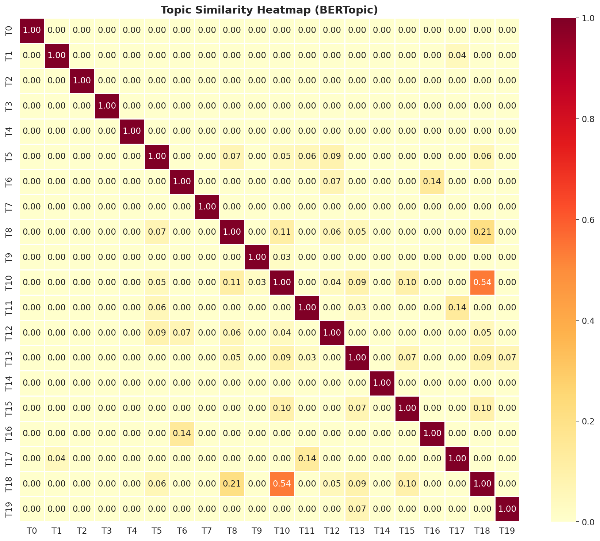

This heatmap shows how similar the discovered topics are to each other, measured by cosine similarity of their word distributions. High similarity between two topics might indicate they could be merged, or it might reflect genuinely related newsgroup categories - for example, the multiple computer hardware groups. Values close to 0 mean the topics are completely distinct, while values close to 1 mean the topics share very similar vocabulary.

---

## Model Comparison

### Coherence Score

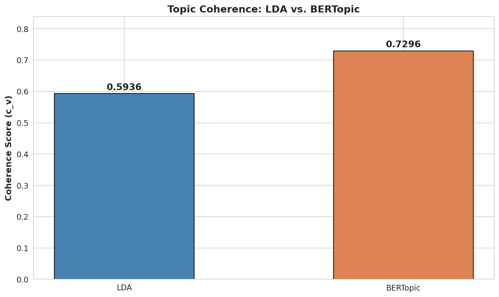

This bar chart compares the coherence scores (c_v) of both models. Coherence measures how well the top words in each topic "make sense together" from a human perspective - higher scores mean the topics are more interpretable. BERTopic scored 0.7296, outperforming LDA's 0.5936 by 22.9%. This means BERTopic's topics are, on average, more semantically coherent and easier for a human to interpret.

### Topics Discovered and Document Coverage

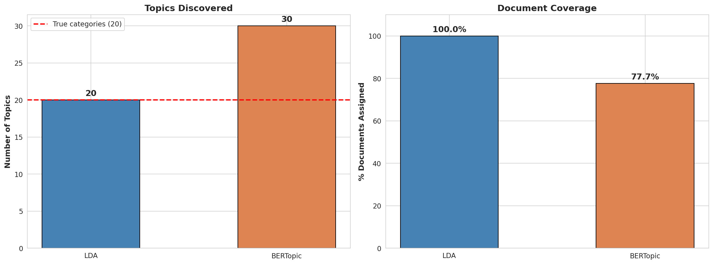

The left panel compares how many topics each model discovered against the true number of categories (20, shown as the red dashed line). LDA found exactly 20 topics (matching the true count), while BERTopic found 30 - suggesting it is picking up on finer-grained subtopics within some categories. The right panel shows document coverage: LDA assigns every document to a topic (100%), while BERTopic assigns 77.7%, labeling the remaining 22.3% as outliers that do not clearly belong to any single topic.

| Metric | LDA | BERTopic |
|--------|-----|----------|
| Coherence (c_v) | 0.5936 | 0.7296 |
| Topics Discovered | 20 | 30 |
| True Categories | 20 | 20 |
| Document Coverage | 100% | 77.7% |

### Side-by-Side Topic Comparison

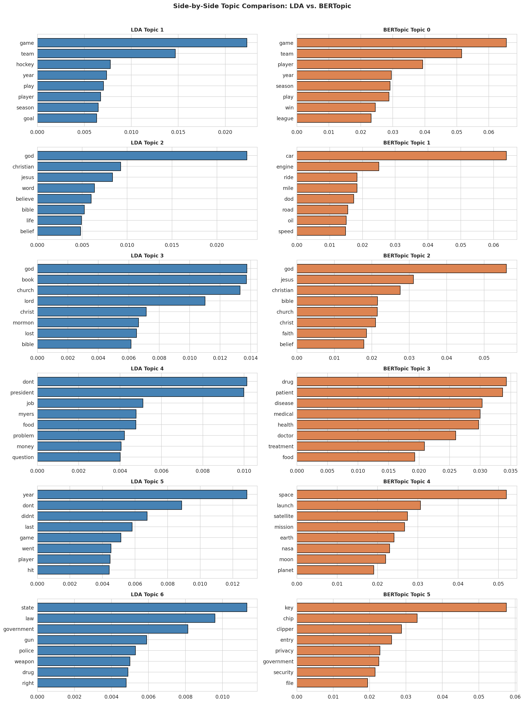

This visualization places LDA topics (blue, left) next to BERTopic topics (orange, right) so you can directly compare the quality and specificity of the discovered themes. BERTopic's topics tend to have more focused, distinctive word lists, while LDA's topics occasionally mix vocabulary from related but different categories. This visual difference reflects the 22.9% coherence gap between the two models.

### Summary Table

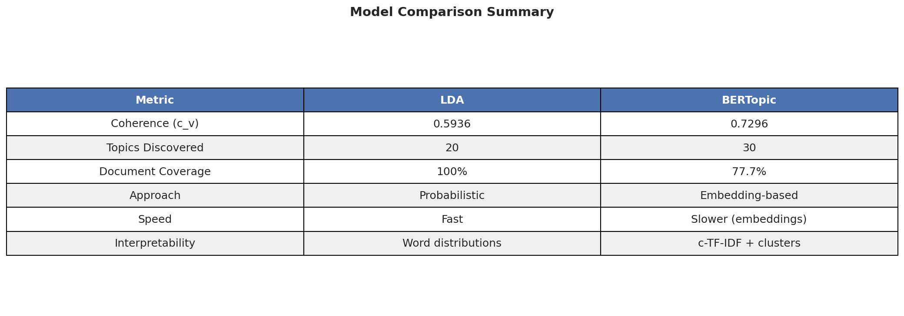

| Metric | LDA | BERTopic |
|--------|-----|----------|
| Coherence (c_v) | 0.5936 | 0.7296 |
| Approach | Probabilistic (bag-of-words) | Embedding-based (transformer) |
| Topic Discovery | Fixed count (tuned via coherence) | Automatic (data-driven) |
| Document Coverage | 100% (assigns every document) | 77.7% (labels outliers) |
| Speed | Fast (minutes) | Slower (embedding generation) |
| Interpretability | Word probability distributions | c-TF-IDF + cluster visualization |
| Bigram Support | No | Yes |

Both models have clear strengths. LDA is fast, assigns every document, and found exactly 20 topics matching the true category count. BERTopic produces more coherent topics, supports bigrams, and provides richer visualizations (like the UMAP cluster plot) - but it is slower and leaves some documents unassigned. The right choice depends on the use case: if you need every document categorized, LDA is the safer choice; if you prioritize topic quality and can tolerate outliers, BERTopic is the stronger option.

---

## Key Design Decisions

| Decision | Rationale |
|----------|-----------|
| 20 Newsgroups dataset | Provides 20 ground truth categories to validate discovered topics - critical for demonstrating that the models are finding real structure, not noise. |
| Removed headers, footers, and quotes | Forces models to discover topics from content rather than metadata like email addresses or reply formatting. |
| Coherence score (c_v) as primary metric | Measures how semantically coherent each topic's top words are from a human perspective - directly captures what makes a topic "good." |
| LDA + BERTopic comparison | Contrasts the classic probabilistic approach (2003) with a modern embedding-based method (2022), showcasing both breadth of knowledge and the evolution of the field. |
| Bayesian hyperparameter tuning (Optuna) | Efficiently searches the hyperparameter space in 5-10 trials per model, avoiding the computational cost of exhaustive grid search while still finding strong configurations. |
| Vocabulary filtering (no_below=15, no_above=0.5) | Removes rare words that add noise and ubiquitous words that do not help distinguish topics, reducing vocabulary from tens of thousands to 8,410 informative terms. |
| HDBSCAN for BERTopic clustering | Unlike K-Means, HDBSCAN does not require specifying the number of clusters upfront and can identify outlier documents that do not belong to any topic - a more honest representation of the data. |
| Sentence-transformers embeddings | Captures semantic meaning beyond word co-occurrence - "automobile" and "car" map to similar vectors even though they share no characters, giving BERTopic a richer understanding of language. |
